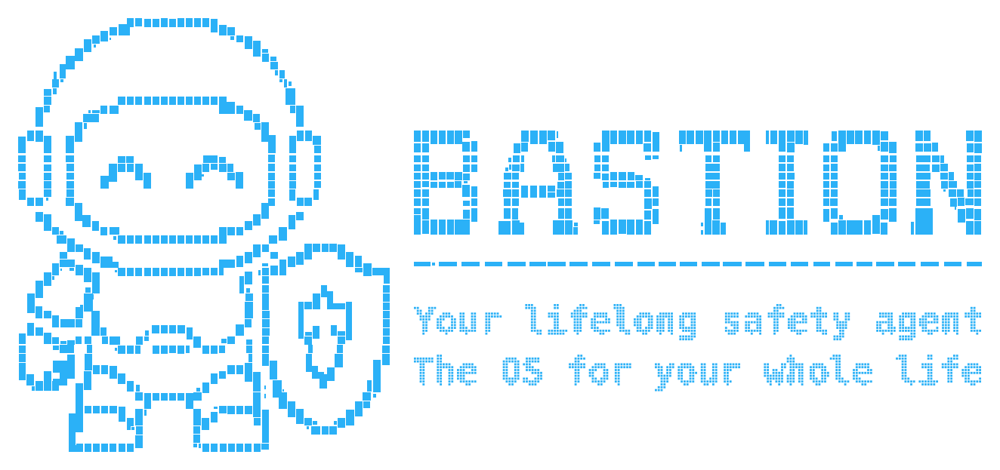

<p align="center">
  
</p>

<p align="center">
  <strong>A self-hosted agent that remembers, acts, and stays answerable to you.</strong>
</p>

<p align="center">
  <a href="https://github.com/thewaifucorp/bastion-agent/actions/workflows/ci.yml"></a>
  <a href="LICENSE"></a>
  <a href="Cargo.toml"></a>
  
  
  <a href="https://waifucorp.org"></a>
</p>

<p align="center">
  <a href="#why-bastion">Why Bastion</a> ·
  <a href="#what-makes-it-different">What is different</a> ·
  <a href="#start-in-minutes">Start</a> ·
  <a href="#documentation">Docs</a> ·
  <a href="#support-bastion">Support</a>
</p>

---

## Your agent should not become the most powerful stranger in your life. 🏰

Most “personal agents” are a chat window with tools bolted on. They can remember things, open links, read emails, run commands—and quietly turn any text they ingest into instructions with more power than the person who owns them.

**Bastion takes the opposite bet.** It is a long-lived personal runtime where memory is challengeable, authority is explicit, and external content never earns permission merely by entering the context.

You own the process, storage, channels, model choice, and boundaries. Bastion helps across time; it does not ask you to hand over the keys and hope its prompt is good enough.

> **Not a chatbot. Not an agent launcher. A durable personal operating layer for an AI that must remain accountable.**

## Why Bastion

The problem is not getting an LLM to answer. The problem is letting an assistant become useful for months or years without letting it become unreviewable, irreversible, or dependent on one vendor’s product decisions.

| You need | Bastion is built around |
| --- | --- |
| Memory that can grow safely | **Contestable, longitudinal memory**: inspect it, correct it, revoke it, and retain its source and validity instead of treating chat history as unquestionable truth. |
| An agent that can act without becoming dangerous | **Authority separation**: a web page, email, attachment, or public message is content—not permission. Capability calls, approvals, and privacy/egress decisions remain separate. |
| A system you can keep | **Self-hosted continuity**: sessions, memory services, personas, and skills live in your deployment rather than inside a disposable SaaS conversation. |
| Real interfaces, not a demo | **One runtime, many surfaces**: CLI, Telegram, webhook/mobile pairing, WhatsApp, Discord, Slack, email, local voice, MCP, and external agent runtimes. |
| Extensions without a permission free-for-all | **Capability-bounded extensibility**: declarative, WASM, and subprocess extensions plug into a controlled host rather than receiving ambient authority on install. |

## What makes it different

### 🧠 Memory you can disagree with

Useful agents need continuity. Dangerous agents accumulate unchallengeable assumptions.

Bastion treats memory as something with provenance, validity, and a lifecycle—not a hidden “profile” that silently becomes policy. The goal is an assistant that can remember years of context while still allowing you to ask: *where did this come from, is it still true, and remove it.*

### 🛡️ Authority is not context

The internet is full of text that looks like instructions. So are emails, documents, issue threads, and public Discord channels.

In Bastion, incoming content is classified by trust. Public Discord/Slack messages and inbound email are untrusted; WhatsApp requests are signature-checked before parsing; unknown channel identities are rejected. Tool use goes through the runtime’s capability boundary—there is no “the model saw it, therefore do it” path.

### 🔑 Your subscriptions, your providers, your exit path

Bastion can run with configured model providers or external agent runtimes, including subscription-backed environments where supported. Credentials remain references in your environment, not agent memory. The product also supports exporting and importing agent state, so the relationship is not trapped in a single chat provider.

### 🧩 Skills and extensions without magical trust

Skills are useful because they add real capability. That is exactly why they must be reviewed as code.

Bastion’s extension host supports declarative packages, WASM, and subprocesses while keeping authority in the runtime. An extension can be installed without being granted a blank check to access your files, money, network, or identities.

### 🌐 A personal runtime, not a single UI

Talk from your terminal today, add Telegram tomorrow, pair the companion app, connect an MCP service, or operate through a channel that fits your life. The channel changes; the identity, memory, safety boundary, and agent remain the same.

```text
you ──► channel / CLI / mobile
                  │
                  ▼
       identity + trust classification
                  │
                  ▼
     Bastion runtime: memory · personas · capabilities · approvals
                  │
                  ▼
          tools, MCP, providers, extensions
```

## Built for the hard parts

| Capability | Why it matters |
| --- | --- |
| **Owner mapping per channel** | Your Discord user ID, Telegram chat, Slack user, phone, and email can resolve to the same canonical owner—unknown senders do not get a session. |
| **Trust-aware ingress** | Public messages and email are not treated like a private instruction from you. |
| **Privacy-aware egress** | Data leaving the runtime is a first-class decision, not an incidental side effect of a tool call. |
| **Portable agent state** | Export/import the agent’s identity, memories, goals, personas, and configuration with the built-in CLI. |
| **Local-first deployment shape** | The provided Compose stack isolates local Python sidecars from internet egress while the core handles only the connections it needs. |
| **MCP-native composition** | Connect MCP services, or compile the optional `bastion mcp-stdio` surface to let another local agent drive Bastion. |

## Start in minutes

Start with the terminal before handing a messaging token to anything.

```bash
git clone https://github.com/thewaifucorp/bastion-agent.git
cd bastion-agent
cargo build
cargo run -- agent --message "What can you safely do in this installation?"
```

Then run the persistent daemon:

```bash
cargo run -- daemon
```

For the full local stack—core, memory, skill-writing, self-improvement, and voice sidecars—review configuration and run:

```bash
docker compose up --build
```

Put secrets in `.env`; keep non-secret behavior in `bastion.toml`. Before enabling a channel, map its allowed owner and read the security model.

## Documentation

| English | Português (Brasil) |
| --- | --- |
| [Start here](docs/en/getting-started.md) | [Comece aqui](docs/pt-br/iniciando.md) |
| [Configuration](docs/en/configuration.md) | [Configuração](docs/pt-br/configuracao.md) |
| [Architecture](docs/en/architecture.md) | [Arquitetura](docs/pt-br/arquitetura.md) |
| [Channels](docs/en/channels.md) | [Canais](docs/pt-br/canais.md) |
| [Security model](docs/en/security.md) | [Modelo de segurança](docs/pt-br/seguranca.md) |
| [All docs](docs/en/README.md) | [Toda a documentação](docs/pt-br/README.md) |

## Support Bastion

<p align="center">
  <a href="https://waifucorp.org">
    <strong>Built with support from wAIfu Corp.</strong>
  </a>
</p>

If Bastion is useful to you, sponsor the work by supporting [wAIfu Corp](https://waifucorp.org). Support keeps the runtime independent, maintainable, and pointed at the difficult problems—durable memory, safe authority, and user-owned agents—instead of chasing the next chatbot wrapper.

## Contributing

Product behavior lives here: channels, configuration, the extension host, and the mobile companion. Changes to the agent loop, providers, memory primitives, cognition, personas, and mesh generally belong in [bastion-core](https://github.com/thewaifucorp/bastion-core).

Read [CONTRIBUTING.md](CONTRIBUTING.md) before opening a pull request or reporting a security issue.

## License

[MIT](LICENSE). Self-host it, adapt it, and build on it.
